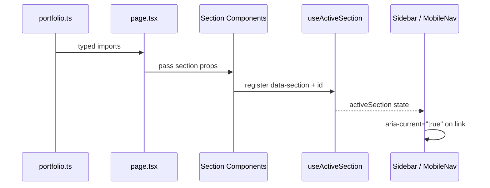

# Design: Initial Portfolio Setup (Renzo Portela)

## Technical Approach

Single-page App Router build: CSS Grid shell (fixed sidebar + scrollable main), static typed content, IntersectionObserver-driven nav, Framer Motion scroll reveals with reduced-motion fallback. No server state, no routes beyond `/`. All copy lives in `src/content/portfolio.ts`.

## Architecture Decisions

| Decision | Choice | Rationale |
|---|---|---|
| **Shell layout** | CSS Grid `grid-template-columns: 300px 1fr` on `md+`, single-column mobile | No JS layout. shadcn/ui sidebar overkill — pulls 5+ primitives for static nav. |
| **Active nav** | Custom `useActiveSection` hook wrapping `IntersectionObserver` | No scroll handlers. Each `<section>` gets `data-section`; observer fires → state → `aria-current`. |
| **Motion** | `framer-motion` v12 with `useReducedMotion()` guard | Used in WaterpoloGER. `whileInView` for scroll reveals, `initial` for mount. Disabled entirely when user prefers reduced motion. |
| **Content source** | Single `src/content/portfolio.ts` with typed constants | One source of truth. Each section imports only its subset. No fetch, CMS, or async. |
| **shadcn/ui** | Only `Button` (CTAs), `Separator` (if needed) | Avoids over-pulling. New York style preset. All other components custom. |
| **Fonts** | Geist Sans + Geist Mono via `next/font/google` | Preloaded in root layout — no layout shift. |
| **Responsive** | `mobile <768px`, `tablet 768–1024px`, `desktop ≥1024px` | Sidebar condenses at tablet (50vw), becomes overlay hamburger at mobile. Content `max-w-[1000px]`. |

## Data Flow

- **Mount**: Page imports sections; each section receives its typed content prop.
- **Scroll**: `useActiveSection` observes `<section data-section="...">` nodes. Calls `setActiveSection(id)` on threshold 0.3.
- **Nav update**: Both sidebar and mobile nav consume `activeSection` via context or prop drill (prefer context for deep tree).
- **Mobile toggle**: `useState<boolean>` in `MobileNav`. `Escape` key closes via `useEffect` keyboard listener. Focus returns to hamburger button.

## File Changes

| File | Action | Description |
|------|--------|-------------|
| `app/layout.tsx` | Create | Root layout: fonts, metadata, `globals.css`, skip-to-content link, `<body>` with sidebar + main grid |
| `app/page.tsx` | Create | Single page composing all section components |
| `app/globals.css` | Create | Tailwind v4 `@import "tailwindcss"`, CSS variables (brand tokens), base styles |
| `src/lib/utils.ts` | Create | `cn()` utility from shadcn/ui |
| `src/content/portfolio.ts` | Create | All Spanish copy: hero, about, experience, projects, skills, languages, contact |
| `src/components/sidebar.tsx` | Create | Fixed left nav: monogram/logo, vertical links, social icons, rotated email |
| `src/components/mobile-nav.tsx` | Create | Hamburger button + overlay sheet with same nav links |
| `src/components/hero.tsx` | Create | Hero section: greeting, name (H1), title, summary, CTAs |
| `src/components/about.tsx` | Create | About section: heading, paragraphs, optional photo |
| `src/components/experience.tsx` | Create | Timeline: 4 items with org, role, dates, highlights |
| `src/components/projects.tsx` | Create | 2 featured projects: image, description, tech stack, links |
| `src/components/skills.tsx` | Create | Skills grid: technical + soft, plus languages |
| `src/components/contact.tsx` | Create | Email link + social icons grid |
| `src/components/social-links.tsx` | Create | Reusable icon-link list (shared by sidebar + contact + footer) |
| `src/components/section-wrapper.tsx` | Create | Wraps sections: `data-section` attr, Framer `whileInView` reveal, `id` anchor |
| `package.json` | Modify | Add framer-motion, lucide-react, shadcn/ui init dependencies |

## Component Contracts

Key type from `src/content/portfolio.ts`: `SocialKind`, `SocialLink`, `CTA`, `ExperienceItem`, `Project`. Each section receives only its subset — no mega-prop. All strings are Spanish. Optional fields (`photo`, `image`, `highlights`) render conditionally without layout breakage.

## Testing

Build verification only: `npm run build` as CI gate. Manual visual/accessibility checks at breakpoints. No unit/E2E — aligns with config (`Testing: None configured`).

## Open Questions

- [ ] Confirm exact Next.js version (`16.0.0` stable vs canary) at scaffold time
- [ ] Confirm `shadcn/ui` init resolution when framework is Next.js 16 (may need `--force`)
